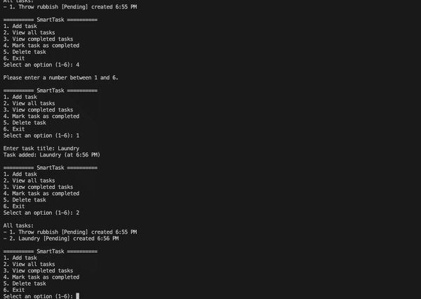

# SmartTaskManager

A lightweight console-based task manager built with C#.  
Supports adding, completing, and deleting tasks — with live event notifications.

This task is mainly to learn the usage of Event in c# .net



## Done tasks

- Event for nofify add, remove
- file read tasks.txt to seed , then edit the content and record in log.txt
 

## Features

- Add new tasks with a title
- View all tasks or just completed ones
- Mark tasks as completed
- Delete tasks by task number (ID)
- Real-time notifications using event handlers

 

## Getting Started

### 1. Clone the repository

```bash
git clone 
cd SmartTaskManager
dotnet build
dotnet run --project SmartTaskApp

```
- Language: C# (.NET 8)